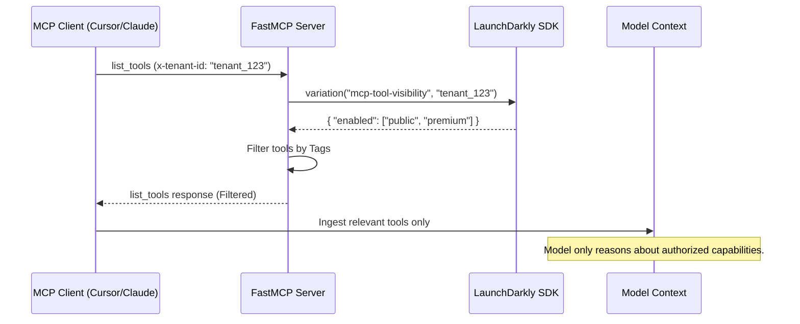

# Multi-Tenant MCP Capability Control with LaunchDarkly

[](https://modelcontextprotocol.io)
[](https://github.com/jlowin/fastmcp)
[](https://launchdarkly.com)

## The Problem: Authorization vs. Visibility
Most MCP implementations focus on **Authorization** (rejecting a call after it happens). In Agentic AI, this is too late. If an LLM sees a tool in its context, it will reason about it, wasting tokens and increasing latency—even if execution is eventually denied.

**This project implements a "Visibility First" architecture.** By using LaunchDarkly as a real-time capability control plane, tools are filtered at the **Discovery** phase. If a tenant isn't authorized, the tool simply does not exist in the model's context.

---

## 🏗 Architecture



### Key Benefits
- **Zero Token Bloat:** Models only process tool definitions relevant to the current tenant.
- **Search Space Reduction:** Improves LLM accuracy by removing irrelevant "reasoning branches."
- **Instant Kill-Switch:** Revoke access to buggy or sensitive tools globally without a redeploy.
- **Tiered SaaS Features:** Dynamically toggle "Pro" vs "Free" tools via Feature Flags.

---

## 🚀 Getting Started

### 1. Prerequisites
- Python 3.10+
- A LaunchDarkly Account and Server SDK Key
- MCP Inspector (for testing)

### 2. Environment Setup
Create a `.env` file in the root directory:
```bash
LD_SDK_KEY=your-launchdarkly-server-sdk-key
LD_FF_KEY=mcp-tool-visibility
```

### 3. Installation
```bash
pip install -r requirements.txt
```

---

## ⚙️ Configuration

### LaunchDarkly Flag Setup
Create a **JSON Variation** flag in LaunchDarkly named `mcp-tool-visibility`.

| Variation Name | JSON Value | Enabled Tools |
| :--- | :--- | :--- |
| **Premium** | `{"enabled": ["public", "premium"]}` | Public + Premium |
| **Trial** | `{"enabled": ["public", "trail"]}` | Public + Trail |
| **Default** | `{"enabled": ["public"]}` | Public only |

---

## 🛠 Usage

### Running the Server
```bash
python main.py
```

### Testing with MCP Inspector
Use the [MCP Inspector](https://github.com/modelcontextprotocol/inspector) to simulate different tenants:

1. Launch the inspector: `npx @modelcontextprotocol/inspector http://localhost:8000`
2. In the **Headers** section, provide a Tenant ID: `x-tenant-id: d2554102-0e7c-4b15-b9db-5eb71d9c9985`
3. Click **List Tools** and observe that only authorized tools appear.

---

## 💻 Implementation Snippet

The core logic resides in the discovery middleware using FastMCP's tag system:

```python
@mcp.list_tools()
async def list_tools(context: FastMCPContext):
    # 1. Extract tenant from headers
    headers = context.request.headers
    tenant_id = headers.get("x-tenant-id", "default")
    
    # 2. Query LaunchDarkly for this specific tenant
    user_context = {"key": tenant_id, "kind": "user"}
    flag_data = ld_client.variation("mcp-tool-visibility", user_context, {"enabled": ["public"]})
    enabled_tags = flag_data.get("enabled", ["public"])
    
    # 3. Apply visibility filter
    # Tools not matching these tags are hidden from the LLM
    await context.reset_visibility()
    await context.enable_components(tags=enabled_tags)
    
    return mcp.get_tools()
```

---

## 🛡 Security Model
Defense-in-depth ensures that even if a model attempts to "guess" a tool name, it is blocked at the gate:
1. **Discovery Layer:** Filters what the model *sees* (LaunchDarkly).
2. **Execution Layer:** Validates that the caller has the right to *run* the tool (FastMCP Middleware).

## 📄 License
MIT © 2026
